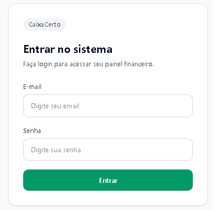
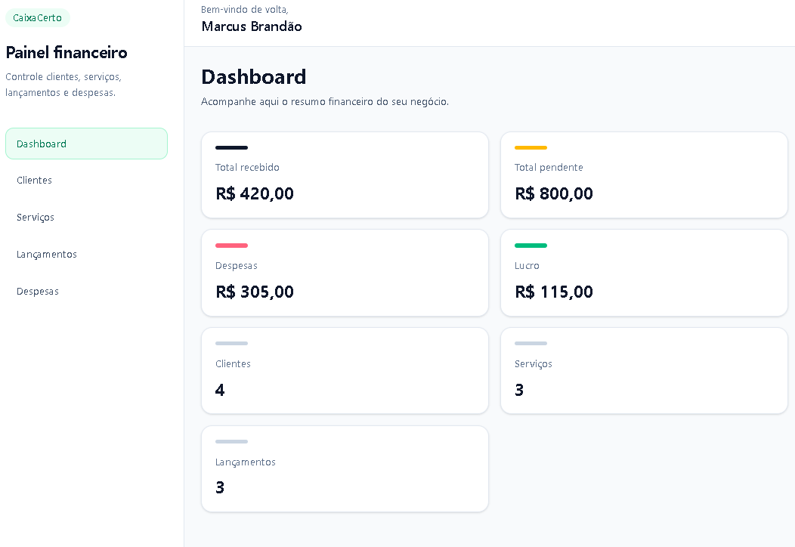
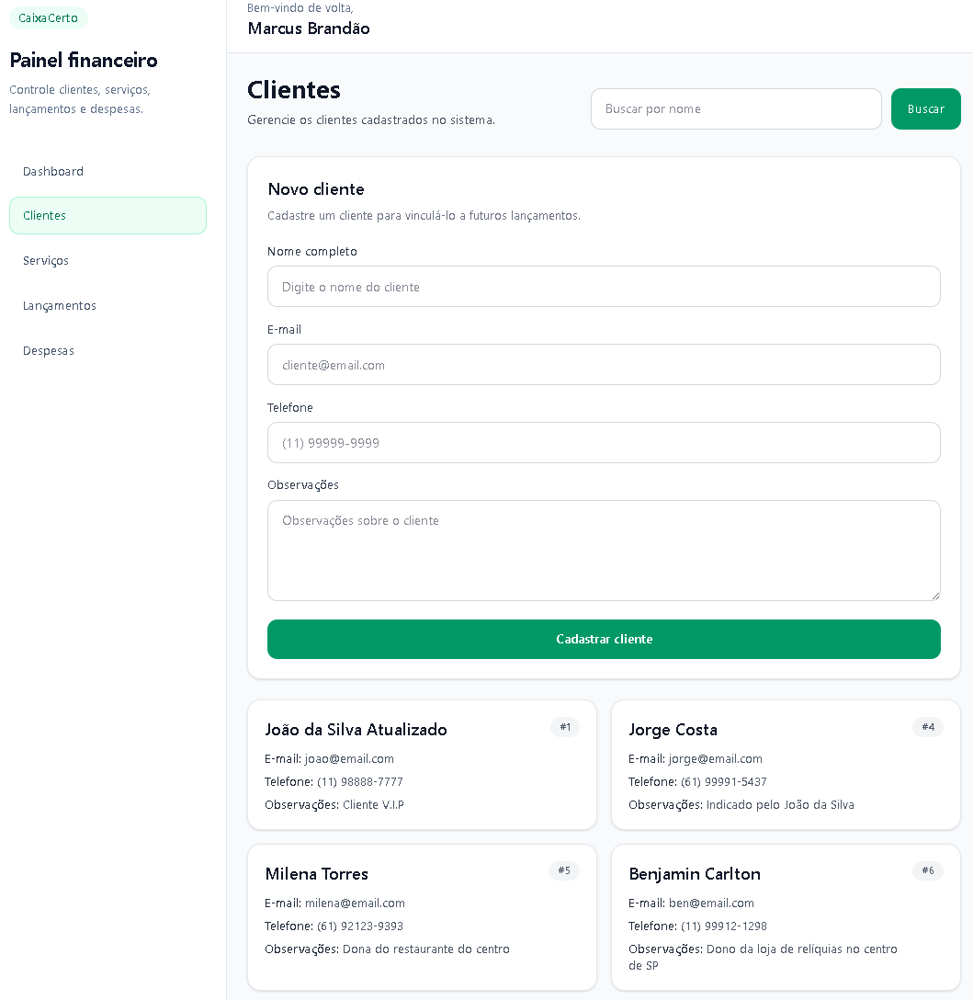
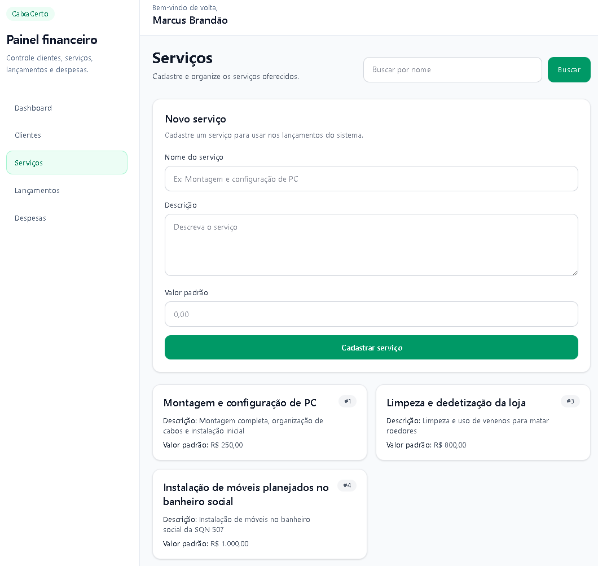
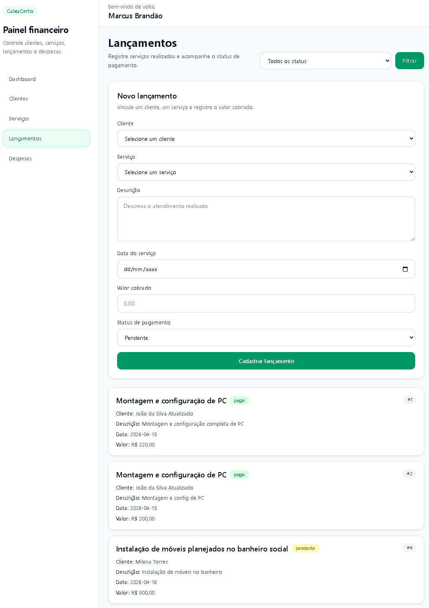
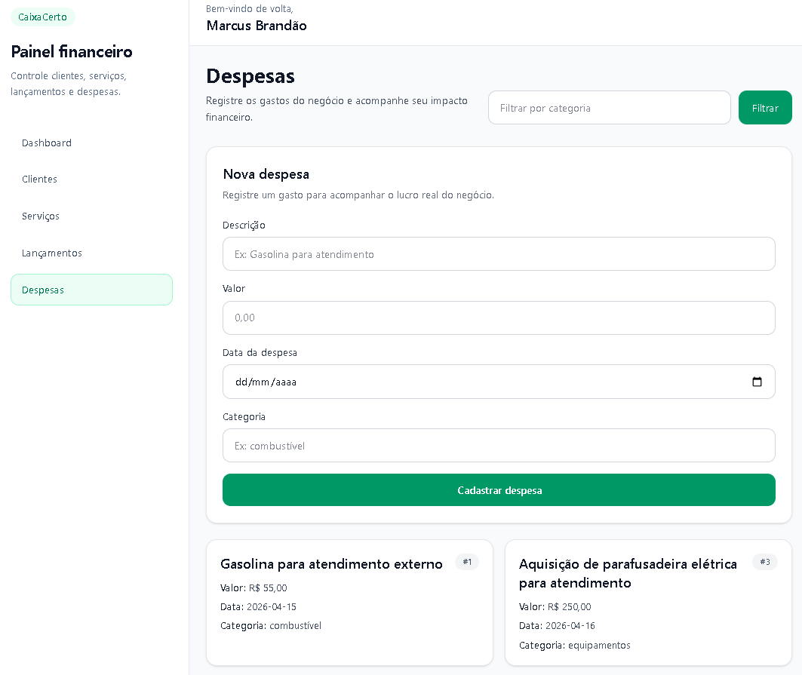

# CaixaCerto
Sistema financeiro para autônomos, desenvolvido para ajudar profissionais a controlarem clientes, serviços, lançamentos, despesas e indicadores financeiros em um só lugar.

## Sobre o projeto
O **CaixaCerto** foi criado como uma aplicação full stack com foco em organização financeira e operacional para profissionais autônomos.  

A proposta do sistema é centralizar o controle do negócio em uma interface simples, clara e prática, permitindo acompanhar atendimentos, pagamentos, gastos e visão geral do desempenho financeiro.

## Screenshots
### Login


### Dashboard


### Clientes


### Serviços


### Lançamentos


### Despesas


## Funcionalidades
### Autenticação
- cadastro de usuário
- login com JWT
- proteção de rotas privadas

### Clientes
- cadastro de clientes
- listagem de clientes
- busca por nome

### Serviços
- cadastro de serviços
- listagem de serviços
- busca por nome

### Lançamentos
- cadastro de lançamentos de serviço
- vínculo entre cliente e serviço
- controle de valor cobrado
- controle de data do serviço
- controle de status de pagamento (`pendente` / `pago`)
- filtro por status

### Despesas
- cadastro de despesas
- listagem de despesas
- filtro por categoria

### Dashboard
- total recebido
- total pendente
- total de despesas
- lucro
- quantidade de clientes
- quantidade de serviços
- quantidade de lançamentos

## Tecnologias utilizadas
### Backend
- FastAPI
- SQLModel
- PostgreSQL
- JWT
- Passlib
- Python Dotenv

### Frontend
- React
- Vite
- Tailwind CSS
- Axios
- React Router DOM

## Estrutura do projeto
```
caixa-certo/
├─ backend/
└─ frontend/
```
---
### Como executar o projeto
## Backend
- Entre na pasta do backend: 
```
cd backend
```
- Crie e ative o ambiente virtual:
```
python -m venv venv
.\venv\Scripts\Activate.ps1
```
- Instale as dependências:
```
pip install -r requirements.txt
```
- Configure o arquivo .env com os dados do banco e autenticação:
```
DATABASE_HOST=localhost
DATABASE_PORT=5432
DATABASE_NAME=caixa_certo_db
DATABASE_USER=postgres
DATABASE_PASSWORD=sua_senha
SECRET_KEY=sua_chave_secreta
ALGORITHM=HS256
ACCESS_TOKEN_EXPIRE_MINUTES=60
```
- Rode o servidor:
```
python -m uvicorn app.main:app --reload
```
## Frontend
- Entre na pasta frontend:
```
cd frontend
```
- Instale as dependências:
```
npm install
```
- Crie o arquivo .env:
```
VITE_API_URL=http://127.0.0.1:8000
```
- Inicie o projeto:
```
npm run dev
```
### Endpoints principais da API
- POST /users/
- POST /auth/login
- GET /users/me
- GET /dashboard/summary
- GET /clients/
- GET /services/
- GET /service-records/
- GET /expenses/

### Autor
Marcus Brandão ->
GitHub: @brandao-m
